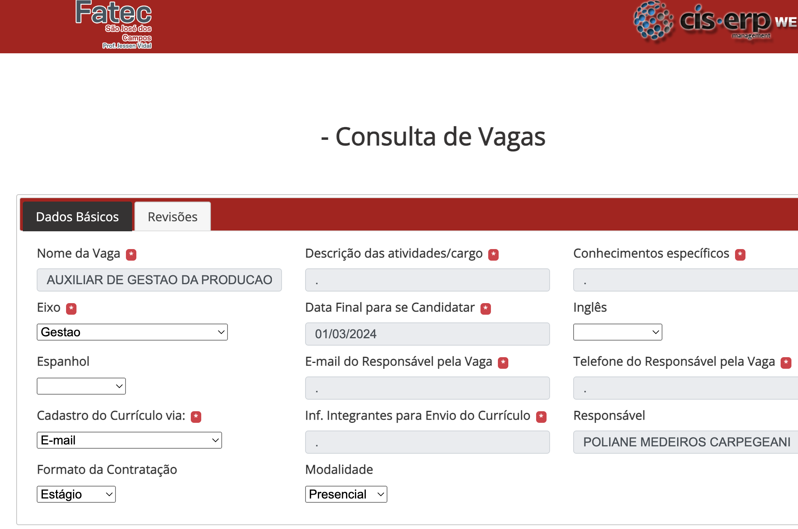
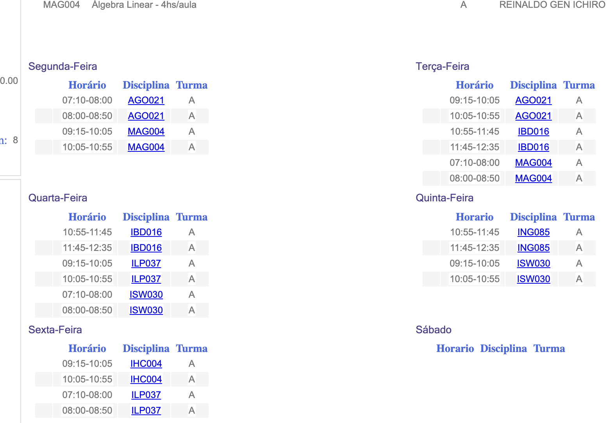
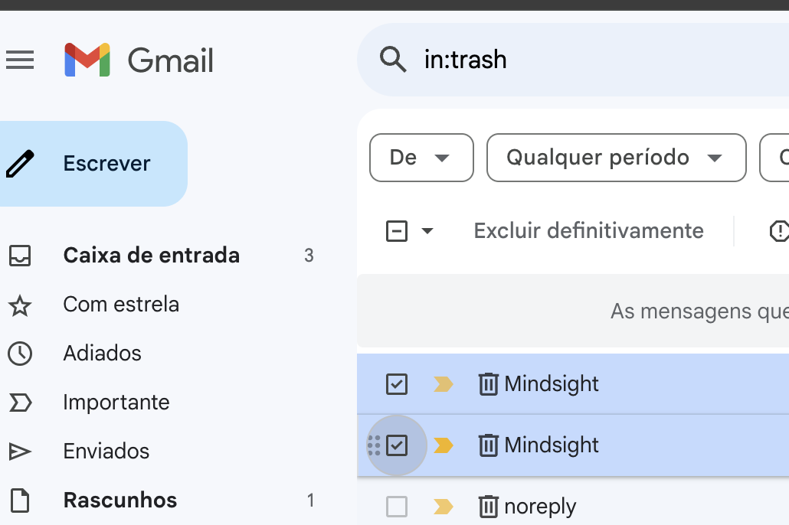

# IHC - GIULIANO BERTOTI

## Repositório de Interação Humano Computador 

### 1 - Visibilidade do status do sistema

Dados faltando para o usuario tomar ação sobre a vaga (sem informação de email para se cadastrar a vaga)

### 4 - Consistência e padrões

Elementos da interface (horários dos cursos) não seguem uma ordem lógica ou consistente, isso pode confundir os usuários e tornar a informação mais difícil de ser compreendida e utilizada.

### 3 - Controle e liberdade do usuário

Não existe uma confirmação após executar a ação de excluir definitivamente o email da lixeira

